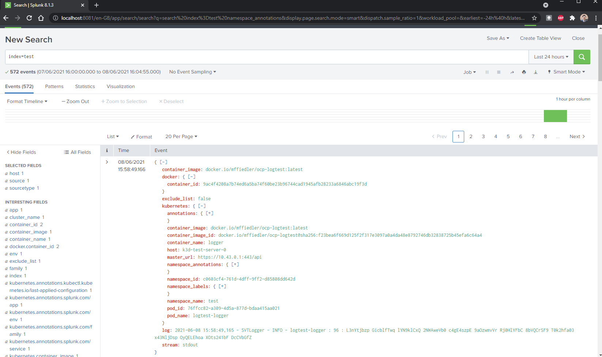
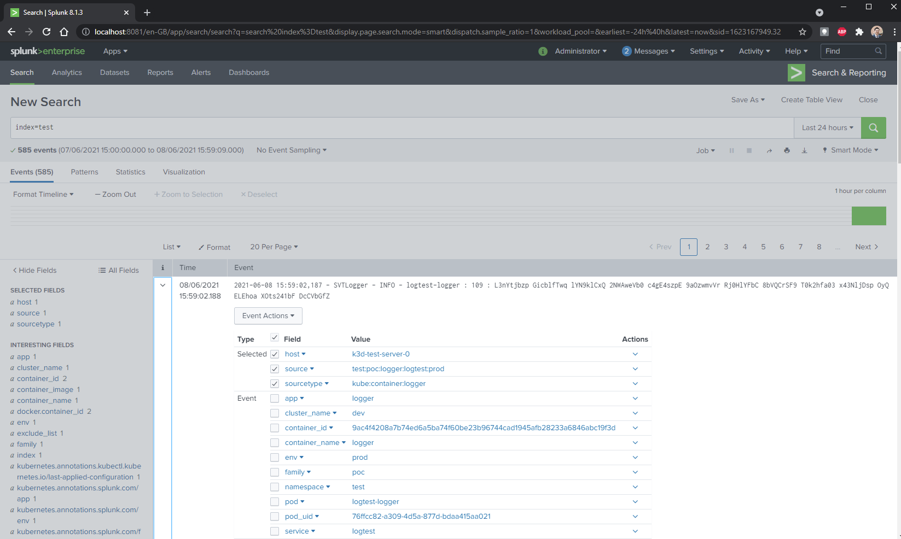

# experiments in splunk-connect-for-kuberetes

### prereqs
This is a toy implementation - assuming on your laptop.  
You will need linux or WSL2.  
You will also need docker, kubectl and helm installed - these are trivailly googleable.  

## Why ?

[splunk connect for kubernetes](https://github.com/splunk/splunk-connect-for-kubernetes) solves the problem of raw logs not containing metadata.  
(container name etc etc).  
  
Old style docker logs _could_ contain custom data if you wanted to by using labels and log-opts, in that case the raw log would look like :  
```bash
{"log":"something","attrs":{"mylabel":"somevalue"}
```
  
Kubernetes doesn't put that info in your logs, and besides, the new logging format for CRI-O runtime eliminates the docker json-logging driver entirely.  

The connector for kubernetes uses fluentd to enrich the logs with metadata, before sending the message to your splunk infra with via the [splunk hec output plugin](https://github.com/splunk/fluent-plugin-splunk-hec)  
  
It does other things too, like collect metrics + infrastructure logs, but thats not explored here.

## Setup

### create k8s cluster

we'll use [k3d](https://k3d.io/) because its simple.  

```bash
k3d cluster create --api-port 6550 -p "8081:80@loadbalancer" test
```

### spin up a splunk container

```bash
kubectl apply -f ./splunk.yaml
```
  
You should be able to get to https://localhost:8081 in a while  
**Now would be a good time to create an index called test**

### deploy the splunk-connector-for-kubernetes 

```bash
helm repo add splunk https://splunk.github.io/splunk-connect-for-kubernetes/
helm install splunk-connect -f splunk-k8s-connect.yaml splunk/splunk-connect-for-kubernetes
```
  
There's some interesting configurations in the splunk-k8s-connect.yaml  

```yaml
  customMetadataAnnotations:
    - name: env
      annotation: splunk.com/env
    - name: family
      annotation: splunk.com/family
    - name: app
      annotation: splunk.com/app
    - name: service
      annotation: splunk.com/service

  # customFilters
  customFilters:
    sourceFilter:
      type: jq_transformer
      tag: tail.containers.**
      body: jq '.record.source = .record.splunk_index + ":" + .record.family + ":" + .record.app + ":" + .record.service + ":" + .record.env | .record'
```

This sets the env, family, app and service fields from the annotations, and uses the jq_transformer to add a unique identifier from the concatenation of these fields

### create something that logs

```bash
kubectl apply -f logger_app.yaml
```
  
This creates an app that logs a few events a second in a namespace called `test`

### route events to different indexes based on container metadata

By default the events go to the main index, but by setting an annotation on the contaier ( or the parent namespace), the events will be routed to an index of your choice.  
Setting the value on the namespace makes more sense in an 'as a service' environment, but its not easy to disable the 'per container' precedence through config alone.  
In this case we are saying to send logs to the test index - **You need to create the index called test for this to work**
  
```bash
kubectl annotate ns/test splunk.com/index=test
```

The magic that makes this work is inside a [fluentd record_transformer](https://github.com/splunk/splunk-connect-for-kubernetes/blob/1.4.7/manifests/splunk-kubernetes-logging/configMap.yaml#L255)

### enable terse logging
  
Up to now we've been loggin the full payload - lets clean that up  
```bash
sed -r 's/(^\s+sendAllMetadata:\s*).*/\1false/' splunk-k8s-connect.yaml
helm upgrade splunk-connect -f splunk-k8s-connect.yaml splunk/splunk-connect-for-kubernetes
```

Before


After

